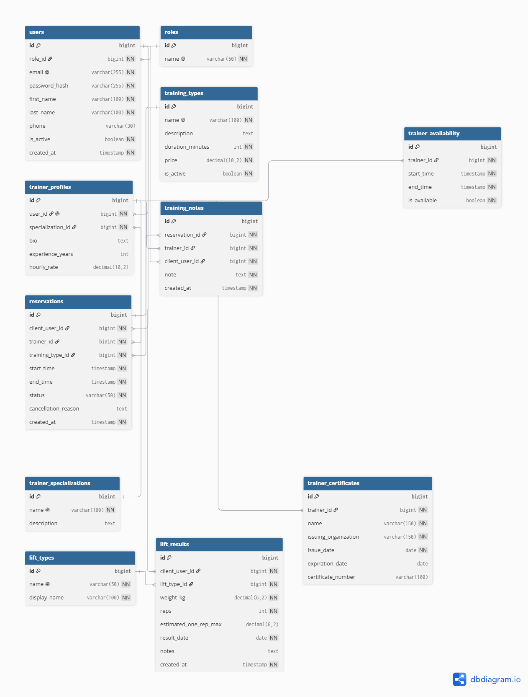

# kuznia


## Backend

Start PostgreSQL:

```bash
docker compose up -d
```

Run the application:

```bash
./mvnw spring-boot:run
```

Default local database settings:

- database: `kuznia`
- user: `kuznia`
- password: `kuznia`
- host port: `5433`
- container port: `5432`

Application URL:

- `http://localhost:8082`
- Swagger UI: `http://localhost:8082/swagger-ui/index.html`

Seeded admin account:

- email: `admin@kuznia.local`
- password: `Admin123!`

## API testing

1. Log in with `POST /api/auth/login`.
2. Copy the `token` value from the response.
3. In Swagger, click `Authorize` and use:

```text
Bearer <token>
```

Public endpoints are available under `/api/public/**`.
